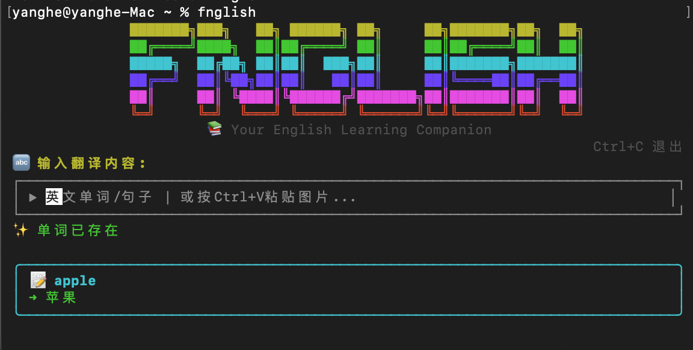

# Fnglish Notebook 

🚀 **一款功能强大的英语学习CLI工具，集实时翻译与智能笔记于一体**

## 📸 软件截图

### 语音朗读功能



### 翻译与单词分析


## ✨ 功能特性

- 🖼️ **图片翻译**: 从剪贴板复制粘贴图片，即时翻译
- 📝 **文本翻译**: 由腾讯云提供支持的快速、精准的文本翻译
- 🔊 **语音朗读**: 实时文本转语音，提供自然的英语发音
- 🤖 **AI 单词分析**: 智能单词分析，包含定义、示例和用法
- 📚 **Notion 集成**: 自动将词汇保存到您的 Notion 数据库
- 🎯 **自适应学习**: 根据您的英语水平调整内容难度
- ⌨️ **直观界面**: 简洁的终端用户界面，支持键盘快捷键

## 🎥 快速开始

```bash
# 全局安装
npm install -g fnglish-notebook

# 运行应用
fnglish
# 或使用备用命令
fnglish-notebook
fnb
```

## 📋 环境要求

- Node.js 18.0.0 或更高版本
- **Grok API 密钥**: 从 [Grok AI](https://console.x.ai/) 获取
- **Notion 集成与页面设置** (详见下文)

## 🌍 平台支持

✅ **Windows**: 支持 PowerShell (Windows 7+)
✅ **macOS**: 原生 AppleScript 支持
✅ **Linux**: 需要安装 `xclip` (Ubuntu: `sudo apt install xclip`)

## 🔧 Notion 集成设置 (重要!)

### 步骤 1: 创建 Notion Integration
1. 访问 [Notion Integrations](https://www.notion.so/my-integrations)
2. 点击 "**New integration**" (新建集成)
3. 填写集成详情:
   - **Name** (名称): 输入 `Fnglish Notebook` 或您喜欢的任何名称
   - **Associated workspace** (关联工作区): 选择您的工作区
   - **Type** (类型): 选择 "Internal integration" (内部集成)
4. 点击 "**Submit**" (提交) 创建
5. **复制 Integration Token** (格式为 `secret_xxx...`) - 这就是您的 **Notion API 密钥**

### 步骤 2: 创建并配置 Notion 页面
1. 在 Notion 中创建一个新页面 (用于存储学习数据)
2. 点击页面右上角的 "**Share**" (分享)
3. 点击 "**Add people, emails, groups, or integrations**" (添加人员、邮箱、群组或集成)
4. 搜索并选择您刚刚创建的集成 (例如 "Fnglish Notebook")
5. 将权限设置为 "**Can edit**" (可编辑)
6. 点击 "**Invite**" (邀请)

### 步骤 3: 获取页面 ID
1. 点击页面右上角的 "**Share**" (分享) → "**Copy link**" (复制链接)
2. 链接格式如下: `https://www.notion.so/workspace/page-title-32-character-string?xxx`
3. **页面 ID 是 URL 中那串 32 个字符的字符串**

   **示例**:
   ```
   链接: https://www.notion.so/myworkspace/English-Learning-1a2b3c4d5e6f7g8h9i0j1k2l3m4n5o6p?pvs=4
   页面 ID: 1a2b3c4d5e6f7g8h9i0j1k2l3m4n5o6p
   ```

### ⚠️ 重要提示
- **您必须先将 Integration 添加到页面**，否则 API 无法访问该页面
- **页面 ID 是一串 32 个字符的字符串**，不包括 URL 中的其他部分
- **确保 Integration 具有编辑权限**，以便创建数据库和添加内容

## 🛠️ 安装

```bash
npm install -g fnglish-notebook
```

## ⚙️ 配置

**重要**: 在运行本应用前，请务必完成上述 **Notion 集成设置** 步骤！

首次运行时，应用将引导您完成配置：

1. **英语水平**: 选择您的英语熟练程度
   - `middle_school`: 中学水平 - 基础词汇和简单语法
   - `university`: 大学水平 - 中级词汇和复杂语法结构
   - `study_abroad`: 留学水平 - 用于学术/专业领域的高级词汇

2. **API 密钥配置**:
   - **Grok API 密钥**: 从 [Grok Console](https://console.x.ai/) 获取，用于 AI 单词分析
   - **Notion API 密钥**: 上述步骤 1 中的 Integration Token (`secret_xxx...`)
   - **Notion 页面 ID**: 上述步骤 3 中的 32 位字符页面 ID

## 🚀 使用方法

### 文本翻译
1. 在输入框中输入或粘贴英文文本
2. 按 Enter 键进行翻译和分析
3. 词汇将自动保存到 Notion

### 图片翻译
1. 将包含文本的图片复制到剪贴板
2. 在应用中按 `Ctrl+V`
3. 图片中的文本将被提取、翻译和分析
4. 词汇将自动保存到 Notion

### 语音朗读
1. 在输入框中输入英文文本
2. 按 `Ctrl+S` 听取发音
3. 采用高品质的 Google 文字转语音技术，提供自然的女性声音

### 键盘快捷键
- `Ctrl+C`: 退出应用
- `Ctrl+V`: 从剪贴板粘贴并翻译图片
- `Ctrl+S`: 播放输入文本的语音
- `Enter`: 提交文本进行翻译

## 📁 配置文件

配置文件存储在 `~/.fnglish-notebook`，包含：
- 英语水平
- API 密钥 (Grok, Notion)
- Notion 页面 ID

## 🔧 API 集成详情

### 腾讯云翻译
- **文本翻译**: 实时文本翻译
- **图片翻译**: 图片的 OCR 识别与翻译
- **内置配置**: 无需额外设置

### 谷歌文字转语音
- **语音质量**: 高品质自然女声 (en-US-Standard-H)
- **语言**: 美式英语发音
- **内置配置**: 无需额外设置

### Grok AI
- **模型**: `grok-4-fast-non-reasoning`，用于快速响应
- **功能**: 单词定义、词性、例句
- **自适应**: 内容难度根据您的英语水平调整

### Notion 数据库
- **自动创建**: 自动创建内联数据库
- **列**: 单词、词性、定义、例句、例句翻译、创建时间
- **智能去重**: 防止重复录入

## 🎯 学习级别

- **中学水平**: 适合年龄的词汇和基础语法结构
- **大学水平**: 复杂的词汇和高级句型
- **留学水平**: 面向国际学生的学术和专业术语

## 🐛 问题排查

### 常见问题

1. **图片翻译不工作**:
   - 确保图片已复制到剪贴板 (而不是保存的文件)
   - 再次尝试复制图片
   - 检查图片是否包含清晰、可读的文本

2. **Notion 数据库未保存**:
   - ✅ **检查是否已将 Integration 添加到页面**: 这是最常见的问题！必须遵循上述步骤 2 邀请集成到页面
   - ✅ **验证 API 密钥格式**: 应为以 `secret_` 开头的长字符串
   - ✅ **验证页面 ID**: 必须是从分享链接中提取的 32 位字符串
   - ✅ **检查权限**: Integration 必须拥有页面的编辑权限 (Can edit)
   - 错误示例: `Notion API error: Object not found` → 通常意味着未将集成添加到页面

3. **API 错误**:
   - 验证所有 API 密钥是否有效
   - 检查网络连接
   - 确保 API 配额未超出

4. **特定平台问题**:
   - **Windows**:
     - 确保 PowerShell 可用 (Windows 7+ 已预装)
     - 如果图片粘贴失败，尝试以管理员身份运行终端
     - 遇到 `clipboard-files` 错误？请查阅 [Windows 修复指南](./WINDOWS-FIX.md)
   - **Linux**:
     - 图片粘贴需要安装 xclip: `sudo apt install xclip`
     - 在 Wayland 桌面环境下可能需要额外配置
   - **macOS**:
     - 系统会请求辅助功能权限，请允许终端访问

## 🤝 贡献

我们欢迎各种贡献！请随时提交问题和功能增强请求。

## 📄 许可证

MIT 许可证 - 详情请见 LICENSE 文件

## 🙏 致谢

- [腾讯云](https://cloud.tencent.com/) 提供翻译服务
- [谷歌云文字转语音](https://cloud.google.com/text-to-speech) 提供语音朗读功能
- [Grok AI](https://grok.com/) 提供智能单词分析
- [Notion](https://notion.so/) 提供笔记集成
- [Ink](https://github.com/vadimdemedes/ink) 提供精美的终端 UI

---

**Made with ❤️ for English learners worldwide**
(为全球英语学习者倾心打造)
